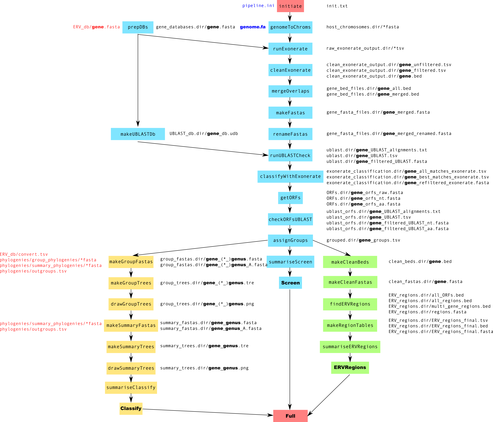

# ERVsearch

ERVsearch is a pipeline for identification of endogenous retrovirus like regions in a host genome, based on sequence similarity to known retroviruses.

## Introduction

ERVsearch screens for endogenous retrovirus (ERV) like regions in any FASTA file using the Exonerate algorithm (Slater and Birney, 2005, doi 10.1186/1471-2105-6-31). 

* In the **Screen** section, open reading frames (ORFs) resembling retroviral *gag*, *pol* and *env* genes are identified based on their level of similarity to a database of known complete or partial retroviral ORFs.
* In the **Classify** section, these ORFs are classified into groups based on a database of currently classified retroviruses.
* In the **ERVRegions** section, regions with ORFs resembling more than one retroviral gene are identified.

## Prerequisites

The pipeline is currently available for Unix-based systems only.

The ERVsearch pipeline requires the following freely available software. All packages are available via pip and easy_install

Python 3.5+ with the following packages:
- ruffus - https://pypi.python.org/pypi/ruffus
- numpy - https://pypi.python.org/pypi/numpy
- pandas - https://pypi.python.org/pypi/pandas
- ete3 - https://pypi.python.org/pypi/ete3
- matplotlib - https://pypi.python.org/pypi/matplotlib

The following commonly used software needs to be installed and in your $PATH
- Samtools: https://sourceforge.net/projects/samtools/files/
- Bedtools: https://github.com/arq5x/bedtools2
- Emboss: http://emboss.sourceforge.net/download/#Stable/
- Mafft: http://mafft.cbrc.jp/alignment/software/linux.html
- FastTree: http://meta.microbesonline.org/fasttree/#Install

The following software also needs to be installed
- Exonerate: http://www.ebi.ac.uk/about/vertebrate-genomics/software/exonerate
- Usearch: http://www.drive5.com/usearch/download.html

Installation
--------------
The latest release of ERVsearch is available via pip3.
`pip3 install ERVsearch`

Alternatively, if you prefer to install directly,  the latest release can be downloaded from Github.
https://github.com/KatyBrown/ERVsearch/releases/latest

The latest (beta) version can also be cloned from github
`git clone https://github.com/KatyBrown/ERVsearch.git`

No compliation is required, just add the ERVsearch directory to your path or use the full path to ERVsearch/ERVsearch. If installed using pip you should be able to call `ERVsearch` directly.

## Quick Start

After cloning the repository, the program can be used as is (with the above prerequisites installed).

1. Make a copy of the pipeline.ini file (templates/pipeline.ini) in your working directory (the directory in which would would like to store the output).

2. Download a local copy of your genome (or other sequence) of interest as a single FASTA file.

3. Edit your copy of pipeline.ini to configure the pipeline for your computer:
	* Add the path to the genome you want to screen (the fasta file in step 2) to the genome section
	 	 e.g. hg38.fa saved in /home/myname/genome/hg38.fa would require the following options:
	 	`[genome]`
	 	`file_=/home/myname/genome/hg38.fa`

	* Add the paths to ERVsearch, usearch and exonerate to the paths section
		e.g.
		`[paths]`
		`path_to_ERVsearch=/home/myname/ERVsearch`
		`path_to_usearch=/home/myname/usearch/usearch11.0.667_i86linux32`
		`path_to_exonerate=/home/myname/exonerate/bin/exonerate`
		
	* Run the pipeline in your working directory as:
		`ERVsearch --target_tasks full -v5` 

## Pipeline Description
The pipeline is designed to identify regions resembling retroviral *gag*, *pol* and *env* genes in a genome (or other set of sequences and to perform various analyses on these regions.

It is divided into three sections:

###Screen
* Screens the genome for ERV like regions by comparing the genome to a set of known retroviral ORFs using Exonerate.
* Confirms the Exonerate regions using UBLAST
* Finds and confirms ORFs within these regions
* Finds the most similar known retroviral ORF in the database to each of the newly identified ORFs

### Classify
* Classifies the newly identified ORFs into groups based on the most similar known ORF
* Aligns the newly identified ORFs with reference sequences within these groups and builds a phylogenetic tree for each group.
* Finds clusters of newly identified ORFs within these trees
* Incorporates representative sequences from these clusters into a summary tree for each retroviral gene and genus  (based on classification into *gamma*, *beta*, *spuma*, *alpha*, *lenti*, *epsilon* and *delta* retroviruses as definied by the ICTV (https://talk.ictvonline.org/taxonomy).

### ERVRegions
* Identifies regions of the genome containing ORFs resembling more than one different retroviral gene within a certain distance

##Input Files

###Required Input Files

1: *FASTA file to screen for ERVs*

The main input file is sequence file in FASTA format (https://en.wikipedia.org/wiki/FASTA_format) containing DNA sequences from the genome of interest which you wish to screen for ERV-like regions. This would usually be a reference or de novo assembled genome but can be any set of DNA sequences.

Reference genome sequences are available from http://www.ensembl.org/info/about/species.html and https://genome-euro.ucsc.edu/index.html (amongst others). 

To be used as an input file, the reference genome needs to be contained in a single FASTA file.

For Ensembl genomes, this would usually be the` GENOMEID.dna.toplevel.fa.gz `file from the "download DNA sequence" page for the appropriate organism, substituting `GENOMEID` for the genome ID (e.g. GRCh38)

For UCSC genomes this would be `GENOMEID.fa.gz` from the bigZips directory for this organism on the FTP server, substituting `GENOMEID` for the genome ID (e.g. hg38)

It is possible to use a gzipped or zipped file, in which case the filename needs to end with .gz or .zip respectively.

2: `pipeline.ini` file

This file is a configuration file in `ini` format (https://en.wikipedia.org/wiki/INI_file) containing the parmeters you wish to use.
This file needs to be in your working directory - the folder in which you wish to run ERVsearch.

A template `pipeline.ini` file should be used and edited - this file is available as templates/pipeline.ini.

Options specified as `!?` are required, all others have a default value.

Required parameters are as follows:

|Section|Parameter|Description|Example|
|-|-|-|-|
|`genome`|`file`|path to genome to screen|`/home/katy/ERVsearch_screen/mygenome.fasta`|
|`paths`|`path_to_ERVsearch`| path to the main ERVsearch folder on your computer|`/home/katy/ERVsearch`|
|`paths`|`path_to_exonerate`|path to the exonerate executable on your computer|`/home/katy/Exonerate2.4.0/bin/exonerate
|`paths`|`path_to_usearch`|path to the USEARCH executable on your computer| `/home/katy/USEARCH/usearch`|

Optional parameters are listed in the **Parameters** section below.

###Optional Input Files
####Custom Databases
By default, ERVsearch will use the provided database of 774 ERV nucleotide sequences and corresponding amino acid sequences as a query against the provided genome. This database is designed to be representative of known retroviruses and to identify the majority of ERVs. However, a more specific custom database can also be provided and used for the initial screen.

To do this, the database_use_custom_db parameter in the pipeline.ini can be set to True. The query sequences should be stored as FASTA files of amino acid sequences, with one file per retroviral gene. Only gag, pol and env genes are currently supported. Very short sequences (less than ~100 amino acids) should be avoided where possible.
The paths to these files are then specified in the database section of the pipeline.ini

e.g.

`[database]`
`use_custom_db=True`
`gag=/home/katy/my_databases/gag_ervs.fasta`
`pol=/home/katy/my_databases/pol_ervs.fasta`
`env=/home/katy/my_databases/env_ervs.fasta`

Currently, custom databases are only used for the initial Exonerate screen and UBLAST check, after this all classification based steps will use the default databases, as these sequences have been classified into subgroups for phylogenetic analysis.

#### Sequence List

`keep_chroms.txt`

A list of chromosome names to include. The names should the names in the fasta file cropped at the first space,  e.g. "NW_006711271.1 Panthera tigris altaica isolate TaeGuk unplaced genomic scaffold" should just be listed as NW_006711271.1. The names should be listed with one name per line, are case sensitive and need to be identical to those in the fasta file. This file needs to be named keep_chroms.txt and in the working directory.

## Usage
### Running the Pipeline
The pipeline is implemented using the pipeline development package ruffus (http://www.ruffus.org.uk/, Goodstadt doi:2010 10.1093/bioinformatics/btq524).

To run the full pipeline, the following command is used:
`ERVsearch --target_tasks full`

If the pipeline stops or fails at any point, it will restart from after the previous fully completed step (based on the presence of the output files from this step).

Sections of the pipeline can be run as follows:

* `ERVsearch --target_tasks Screen` - screen with Exonerate and check the results with UBLAST, find ORFs and find the most similar known retroviral ORF.

* `ERVsearch --target_tasks Classify` - run the *Screen* steps and then sort the sequences into subgroups, build phylogenetic trees for these groups and a summary tree for each gene and genus.

* `ERVsearch --target_tasks ERVRegions` - run the *Screen* steps and then find regions with ORFs resembling more than one retroviral gene in close proximity.

* `ERVsearch --target_tasks full` - run all the above sections.

You can also run the pipeline up until a specific function - any function name can be provided for the `target_tasks` parameter.

If you only wish to run part of the pipeline, any function name can be provided instead of "full" in the other command, for example to run up until the end of the function `classifyWithExonerate`, use the following command.
`ERVsearch --target_tasks classifyWithExonerate` All functions prior to this function will run if needed.

### Parallelisation
The pipeline is paralellised to run jobs simultaneously where possible. To do this, set the parameter`--jobs N` in the command line, where N is the number of CPUs available on your machine.
e.g.
`ERVsearch --target_tasks full --jobs 8` 
would run on 8 CPUs

If running on a high performance cluster, it is recommended to use a single node and set `--jobs` to the number of cores available on that node.

###Verbosity
Ruffus verbosity is set using the `-v` parameter from 0 to 10. The recommended setting is -v 5.

e.g.
`ERVsearch --target_tasks full -v 5`

### Parameters

## Detailed Function Descriptions
 
NB: Where `GENE` is specified in a file path one file will be created for each gene - *gag*, *pol* and *env* (unless otherwise specified by the user).

#### initiate
**Input Files** `pipeline.ini`
**Output Files** `init.txt`
**Parameters**
`[genome] file`
`[paths] path_to_ERVsearch`
`[paths] path_to_usearch`
`[paths] path_to_exonerate`

Initialises the pipeline and checks that the required parameters in the pipeline.ini are set and valid and that the required software is in your $PATH.

Checks that:
	* The input genome file exists.
	* The correct path to ERVsearch is provided.
	* samtools, bedtools, FastTree and mafft are in the $PATH
	* The correct paths to usearch and exonerate are provided.
 
`init.txt` is a placeholder to show that this step has been completed.

### Screen
#### genomeToChroms
**Input Files** *genome_file*, `keep_chroms.txt`
**Output Files**  `host_chromosomes.dir/*fasta`
**Parameters**
`[genome] file`
`[genomesplits] split`
`[genomesplits] split_n`
`[genomesplits] force`

Splits the host genome provided by the user into FASTA files of a suitable size to run Exonerate efficiently.

If `genomesplits_split` in the pipeline.ini is False, the genome is split into one fasta file for each sequence - each chromosome, scaffold or contig.

If `genomesplits_split` in the pipeline.ini is True, the genome is split into the number of batches specified by the `genomesplits_splitn` parameter, unless the total number of sequences in the input file is less than this number.

The pipeline will fail if the number of sequences which would result from the genomesplits settings would result in >500 Exonerate runs, however it is possible to force the pipeline to run despite this by setting `genomesplits_force` to True.

If the file keep_chroms.txt exists in the working directory only chromosomes listed in this file will be kept.

An unzipped copy of zipped and gzipped fasta files will be created or a link to the file if it is already unzipped. this will be named `genome.fa` and be in the working directory.

This function generates a series of fasta files which are stored in the host_chromosomes.dir directory.

#### prepDBs
**Input Files** None
**Output Files** `gene_databases.dir/GENE.fasta`
**Parameters**
`[database] use_custom_db`
`[database] gag`
`[database] pol`
`[database] env`

 Retrieves the gag, pol and env amino acid sequence database fasta files and puts a copy of each gene_databases.dir directory.
    
 If custom databases are used they are retrieved and named as gag.fasta  pol.fasta, env.fasta so the path doesn't need to be changed every time.

#### runExonerate
**Input Files** `gene_databases.dir/GENE.fasta`, `host_chromosomes.dir/*fasta`
**Output Files** `raw_exonerate_output.dir/GENE_*.tsv`

**Parameters**
`[paths] path_to_exonerate`

Runs the `protein2dna` algorithm in the Exonerate software package with the host chromosomes (or other regions) in `host_chromosomes.dir` as target sequences and the FASTA files from prepDBs as the query sequences.

The raw output of Exonerate is stored in the raw_exonerate_output directory, one file is created for each combination of query and target sequences.

This step is carried out with low stringency as results are later filtered using UBLAST and Exonerate.
    
  
#### cleanExonerate
**Input Files** `raw_exonerate_output.dir/GENE_*.tsv`
**Output_Files**
`clean_exonerate_output.dir/GENE_*_unfiltered.tsv`
`clean_exonerate_output.dir/GENE_*_filtered.tsv`
`clean_exonerate_output.dir/GENE_*.bed`

**Parameters**
`[exonerate] min_hit_length`

Filters and cleans up the Exonerate output.
	* Converts the raw Exonerate output files into dataframes - GENE_unfiltered.tsv
	* Filters out any regions containing introns (as defined by Exonerate)
	* Filters out regions less than `exonerate_min_hit_length` on the host sequence (in nucleotides).
	* Outputs the filtered regions to GENE_filtered.tsv
	* Converts this to bed format and outputs this to GENE.bed

#### mergeOverlaps
**Input Files** `clean_exonerate_output.dir/GENE_*.bed`
**Output_Files** `gene_bed_files.dir/GENE_all.bed`, `gene_bed_files.dir/GENE_merged.bed`
**Parameters**
`[exonerate] overlap`

Merges the output bed files for individual sections of the input genome into a single bed file.

Overlapping regions or very close together regions of the genome detected by Exonerate with similarity to the same retroviral gene are then merged into single regions.  This is performed using bedtools merge on the bed files output by cleanExonerate.

If there is a gap of less than `exonerate_overlap` between the regions they will be merged.

#### makeFastas
**Input Files** `gene_bed_files.dir/GENE_merged.bed`, `genome.fa`
**Output Files** `gene_fasta_files.dir/GENE_merged.fasta`
**Parameters** None
Fasta files are generated containing the sequences of the merged regions of the genome identified using mergeOverlaps.
These are extracted from the host chromosomes using bedtools getfasta https://bedtools.readthedocs.io/en/latest/content/tools/getfasta.html.

#### renameFastas
**Input Files** `gene_fasta_files.dir/GENE_merged.fasta`
**Output Files** `gene_fasta_files.dir/GENE_merged_renamed.fasta`
**Parameters** None

 Renames the sequences in the fasta files of ERV-like regions identified with Exonerate so each record has a numbered unique ID (gag1, gag2 etc). Also removes ":" from sequence names as this causes problems later.
 

#### makeUBLASTDb
**Input Files** `gene_databases.dir/GENE.fasta`
**Output Files** `UBLAST_db.dir/GENE_db.udb`
**Parameters** `[paths] path_to_ublast`
USEARCH requires an indexed database of query sequences to run. This function generates this database for the three gene amino acid fasta files used to screen the genome.

#### runUBLASTCheck
**Input Files**
`UBLAST_db.dir/GENE_db.udb`
`gene_fasta_files.dir/GENE_merged.fasta`
**Output Files**
`ublast.dir/GENE_UBLAST_alignments.txt`
`ublast.dir/GENE_UBLAST.tsv`
`ublast.dir/GENE_filtered_UBLAST.fasta`
**Parameters**
`[paths] path_to_usearch`
`[usearch] min_id`
`[usearch] min_hit_length`
`[usearch] min_coverage`

 ERV regions in the fasta files generated by makeFasta are compared to the ERV amino acid database files for a second time, this time using USEARCH (https://www.drive5.com/usearch/). Using both of these tools reduces the number of false positives.

This allows sequences with low similarity to known ERVs to be filtered out.  Similarity thresholds can be set in the pipeline.ini file (`usearch_min_id,` - minimum identity between query and target -  `usearch_min_hit_length` - minimum length of hit on target sequence -  and `usearch_min_coverage` - minimum proportion of the query sequence the hit should cover).

The raw output of running UBLAST against the target sequences is saved in GENE_UBLAST_alignments.txt (equivalent to the BLAST default output) and GENE_UBLAST.tsv (equivalent to the BLAST -outfmt 6 tabular output) this is already filtered by passing the appropriate parameters to UBLAST. The regions which passed the filtering and are therefore in these output files are then output to a FASTA file GENE_filtered_UBLAST.fasta.

#### classifyWithExonerate
**Input Files**
`ublast.dir/GENE_filtered_UBLAST.fasta`
`ERVsearch/ERV_db/all_ERVs_nt.fasta`

**Output Files**
`exonerate_classification.dir/GENE_all_matches_exonerate.tsv`
`exonerate_classification.dir/GENE_best_matches_exonerate.tsv`
`exonerate_classification.dir/GENE_refiltered_matches_exonerate.fasta`
**Parameters**
`[paths] path_to_exonerate`
`[exonerate] min_score`

Runs the Exonerate ungapped algorithm with each ERV region in the fasta files generated by makeFasta as queries and the all_ERVs_nt.fasta fasta file as a target, to detect which known retrovirus is most similar to each newly identified ERV region. Regions which don't meet a minimum score threshold (`exonerate_min_score`) are filtered out.

all_ERVs_nt.fasta contains nucleic acid sequences for many known endogenous and exogenous retroviruses with known classifications.

First all seqeunces are compared to the database and the raw output is saved as exonerate_classification.dirGENE_all_matches_exonerate.tsv. Results need a score greater than `exonerate_min_score`
against one of the genes of the same type (*gag*, *pol* or *env*) in the database. The highest scoring result which meets these critera for each sequence is then identified and output to exonerate_classification.dir/GENE_best_matches_exonerate.tsv. The sequences which meet these critera are also output to a FASTA file exonerate_classification.dir/GENE_refiltered_exonerate.fasta.

#### getORFs
**Input Files**
`exonerate_classification.dir/GENE_refiltered_matches_exonerate.fasta`
**Output Files**
`ORFs.dir/GENE_orfs_raw.fasta`
`ORFs.dir/GENE_orfs_nt.fasta`
`ORFs.dir/GENE_orfs_aa.fasta`
**Parameters**
`[orfs] translation_table`
`[orfs] min_orf_len`

Finds the longest open reading frame in each of the ERV regions in the filtered output table.

This analysis is performed using EMBOSS revseq (to reverse complement,http://emboss.open-bio.org/rel/dev/apps/revseq.html) and EMBOSS transeq (to translate, http://emboss.open-bio.org/rel/dev/apps/transeq.html).

The sequence is translated in all six frames using the user specified translation table. The longest ORF is then identified. ORFs shorter than orfs_min_orf_length are filtered out. 

The positions of the ORFs are also convered so that they can be extracted directly from the input sequence file, rather than using the co-ordinates relative to the original Exonerate regions.

The raw transeq output, the nucleotide sequences of the ORFs and the amino acid sequences of the ORFs are written to the output FASTA files.

#### checkORFsuBLAST
**Input Files**
`ORFs.dir/GENE_orfs_nt.fasta`
`UBLAST_dbs.dir/GENE_db.udb`
**Output Files**
`ublast_orfs.dir/GENE_UBLAST_alignments.txt`
`ublast_orfs.dir/GENE_UBLAST.tsv`
`ublast_orfs.dir/GENE_filtered_UBLAST.fasta`
**Parameters**
`[paths] path_to_usearch`
`[usearch] min_id`
`[usearch] min_hit_length`
`[usearch] min_coverage`

ERV ORFs in the fasta files generated by the ORFs function are compared to the original ERV amino acid files using UBLAST. This allows any remaining sequences with poor similarity to known ERVs to be filtered out.

This allows ORFs with low similarity to known ERVs to be filtered out.   Similarity thresholds can be set in the pipeline.ini file (`usearch_min_id,` - minimum identity between query and target -  `usearch_min_hit_length` - minimum length of hit on target sequence -  and `usearch_min_coverage` - minimum proportion of the query sequence the hit should cover).

The raw output of running UBLAST against the target sequences is saved in GENE_UBLAST_alignments.txt (equivalent to the BLAST default output) and GENE_UBLAST.tsv (equivalent to the BLAST -outfmt 6 tabular output) this is already filtered by passing the appropriate parameters to UBLAST. The regions which passed the filtering and are therefore in these output files are then output to a FASTA file GENE_filtered_UBLAST.fasta.

#### assignGroups
**Input Files**
`ublast_orfs.dir/GENE_UBLAST.tsv`
`ERVsearch/ERV_db/convert.tsv`
**Output Files**
`grouped.dir/GENE_groups.tsv`
**Parameters**
`[paths] path_to_ERVsearch`
Many of the retroviruses in the input database all_ERVs_nt.fasta have been classified into groups based on sequence similarity, prior knowledge and phylogenetic clustering.  Some sequences don't fall into any well defined group, in these cases they are just assigned to a genus, usually based on prior knowledge. The information about these groups is stored in the provided file ERVsearch/ERV_db/convert.tsv.

Each sequence in the filtered fasta file of newly identified ORFs is assigned to one of these groups based on the sequence identified as the most similar in the classifyWithExonerate step. 

The output table is also  tidied up to include the UBLAST output, chromosome, ORF start and end positions, genus and group.
    '''

#### summariseScreen
#### Screen
### Classify
#### makeGroupFastas
#### makeGroupTrees
#### drawGroupTrees
#### makeSummaryFastas
#### makeSummaryTrees
#### drawSummaryTrees
#### summariseClassify
#### Classify
### ERVRegions
#### makeCleanBeads
#### makeCleanFastas
#### findERVRegions
#### makeRegionTables
#### summariseERVRegions
#### ERVRegions
#### Full

